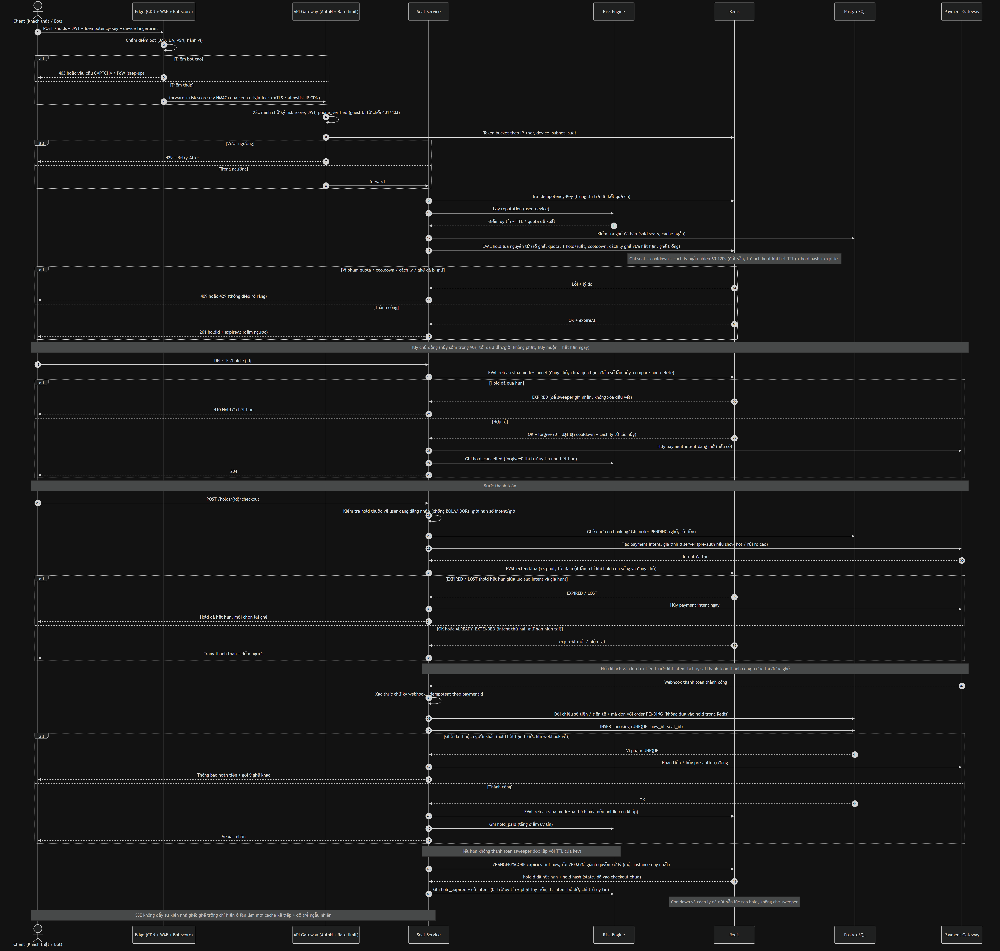

# Bài toán 1: Chống tấn công "Giữ ghế ảo" (Seat Hoarding)

> **TL;DR**
> 1. Gốc rễ: giữ ghế **miễn phí, không giới hạn, nhả tức thì** khi hết hạn, nên bot giữ vô hạn mà không tốn gì (V1, V2, V6).
> 2. Luật nghiệp vụ là tầng chính: quota 8 ghế/1 hold mỗi suất, TTL 5 phút, gia hạn 1 lần khi đã vào thanh toán, cooldown, giới hạn hủy.
> 3. Ghế hết hạn hoặc bị hủy muộn được **cách ly ngẫu nhiên** trước khi trống lại cho tài khoản mới, cắt vòng lặp canh giờ kể cả khi bot dùng nhiều tài khoản.
> 4. Redis + Lua nguyên tử cho hold; PostgreSQL `UNIQUE` đảm bảo không bán trùng; ai thanh toán thành công trước thì được ghế.
> 5. Uy tín tính trên mọi hold không thanh toán. Xác minh SĐT bắt buộc khi đăng ký; CAPTCHA chỉ hiện khi rủi ro cao; pre-auth chỉ bật cho suất hot.

## 0. Tóm tắt và giả định

**Bản chất vấn đề.** Đây không phải lỗi kỹ thuật như SQL injection hay XSS. Đây là **lạm dụng logic nghiệp vụ** (OWASP API6:2023 *Unrestricted Access to Sensitive Business Flows*), kèm **cạn kiệt tài nguyên nghiệp vụ** (API4:2023). Mọi request của attacker đều hợp lệ về mặt kỹ thuật. Thứ bị khai thác là một quy tắc kinh doanh: *"giữ ghế miễn phí, không cần cam kết"*.

**Hệ quả cho thiết kế.** WAF hay rate limit một mình không thể giải quyết. Mục tiêu thực tế không phải "chặn tuyệt đối" (không tồn tại), mà là **làm chi phí tấn công lớn hơn lợi ích**, đồng thời giữ ma sát cho khách thật gần bằng 0.

**Giả định kiến trúc** (nêu rõ để người đọc đánh giá được tính phù hợp):

- Java 17 + Spring Boot, Spring Cloud Gateway hoặc Bucket4j cho rate limit.
- Redis (primary + replica, Sentinel) lưu trạng thái giữ chỗ tạm thời.
- PostgreSQL là nguồn sự thật cho vé đã bán.
- Cổng thanh toán bên thứ ba (VNPay, MoMo, Stripe...) có webhook.
- Quy mô: chuỗi rạp vừa, vài nghìn request/giây ở đỉnh một suất hot.

---

## 1. Phân tích chi tiết các lỗ hổng

### 1.1 Quy trình hiện tại và nơi bị khai thác

Chọn ghế, hệ thống **khóa 10–15 phút**, chờ thanh toán, hết hạn thì tự nhả ghế. Mọi lỗ hổng bên dưới xuất phát từ việc bước *khóa* **không tốn gì** với người gọi và **không bị giám sát**.

### 1.2 Bảng lỗ hổng

| ID | Lỗ hổng | Nguyên nhân gốc | Attacker khai thác thế nào | Mức độ |
|----|---------|-----------------|----------------------------|--------|
| V1 | **Hold miễn phí, không cam kết** | Khóa ghế không đòi hỏi tiền, cọc hay bất kỳ chi phí nào | Giữ ghế vô hạn lần mà không mất gì | **Nghiêm trọng** (gốc rễ) |
| V2 | **Không giới hạn số ghế/lượt giữ** | Thiếu quota theo user, suất chiếu, tổng số hold đang sống | Một tài khoản giữ cả phòng chiếu | **Nghiêm trọng** |
| V3 | **Rate limit yếu hoặc chỉ theo IP** | Định danh duy nhất là IP, dễ thay đổi | Proxy xoay vòng, residential proxy, botnet | **Cao** |
| V4 | **Tạo tài khoản không rào cản** (Sybil) | Chỉ cần email, không xác minh số điện thoại/thiết bị | Tạo hàng nghìn tài khoản tự động | **Cao** |
| V5 | **Không có phát hiện bot** | Không CAPTCHA, không device fingerprint, không phân tích hành vi | Script gọi thẳng API với tốc độ máy | **Cao** |
| V6 | **TTL cố định và nhả ghế tức thì** | Hết hạn là ghế trống ngay, không cooldown | Bot canh đúng thời điểm hết hạn để giữ lại trong vài ms | **Nghiêm trọng** |
| V7 | **Không có điểm uy tín/hình phạt** | Hành vi "giữ rồi bỏ" không để lại dấu vết để xử lý | Lặp vô hạn không hậu quả | **Cao** |
| V8 | **Không giám sát chỉ số nghiệp vụ** | Chỉ giám sát lỗi HTTP, không theo dõi tỉ lệ giữ/thanh toán | Tấn công kéo dài hàng giờ mà không ai biết | **Cao** |
| V9 | **Mọi ghế "đắt" như nhau với attacker** | Không phân biệt ghế giá trị cao (VIP, giữa) về điều kiện giữ | Chỉ nhắm đúng ghế đẹp, tối đa hóa thiệt hại | **Trung bình** |
| V10 | **API lộ dữ liệu và gọi trực tiếp được** | Sơ đồ ghế realtime không cache, không ký request, endpoint hold gọi được ngoài UI | Quét trạng thái ghế liên tục, tự động hóa không cần giao diện | **Trung bình** |
| V11 | **Hold nhiều ghế không nguyên tử** | Kiểm tra rồi mới ghi (check-then-set) | Giữ dở dang một phần, ghế kẹt, tạo race condition | **Trung bình** |
| V12 | **Hết hạn dựa vào job định kỳ** | Cron nhả ghế mỗi vài phút | Ghế "mồ côi" sau hạn, bị coi như vẫn khóa | **Thấp** |
| V13 | **Lạm dụng gia hạn / payment intent** | Gia hạn gắn với việc "tạo payment intent" mà không giới hạn số intent | Gọi checkout liên tục để kéo dài hold mãi mãi mà không trả tiền; hoặc dùng pre-auth để dò thẻ (card testing) | **Cao** |
| V14 | **Thiếu kiểm tra quyền trên đối tượng (BOLA/IDOR)** | `/holds/{id}`, `/checkout`, hủy hold chỉ dựa vào `holdId` | Đoán/lộ `holdId` rồi hủy hold của khách thật, hoặc xóa hold sau khi ghế đã sang người khác | **Cao** |
| V15 | **Vượt Edge bằng cách gọi thẳng origin** | Gateway/origin mở ra Internet, tin header `risk score` từ bất kỳ ai | Bỏ qua CDN/WAF, tự gắn header "điểm thấp", đánh thẳng vào API | **Cao** |
| V16 | **"Hủy chủ động" làm cửa sau** | Hủy được miễn cooldown/phạt, không giới hạn số lần | Giữ 4 phút 59 giây, bấm hủy, giữ lại ngay; hoặc hủy ngay sau khi hết hạn để xóa dấu vết | **Cao** |
| V17 | **Luân phiên tài khoản (Sybil relay)** | Cooldown chỉ gắn với user/thiết bị cũ, ghế hết hạn là trống với mọi người | Tài khoản A hết hạn, tài khoản B (thiết bị giả mới) giữ lại cùng ghế trong vài ms; `deviceId` do client gửi nên giả được | **Cao** |

### 1.3 Chuỗi tấn công (kill chain)

1. **Chuẩn bị:** tạo tài khoản hàng loạt, xoay IP, tìm IP origin để vượt CDN (V3, V4, V15).
2. **Thăm dò:** quét sơ đồ ghế để chọn ghế đẹp còn trống (V10).
3. **Chiếm ghế:** hold song song mọi suất hot (V1, V2, V5).
4. **Duy trì:** canh đúng lúc hết TTL để hold lại ngay, luân phiên tài khoản, hủy/giữ lại hoặc checkout giả để kéo dài (V6, V7, V13, V16, V17).
5. **Che giấu:** mọi request đều hợp lệ nên không kích hoạt cảnh báo (V8).

### 1.4 Tác động

- **Doanh thu:** ghế đẹp, ghế giá cao bán được ít nhất, suất hot gần như bị "bóp nghẹt".
- **Khách hàng:** thấy "hết ghế" dù phòng gần như trống, rời bỏ sang đối thủ.
- **Dữ liệu và vận hành:** số liệu "ghế đã giữ" sai lệch, ảnh hưởng quyết định chiếu phim.
- **Thương hiệu:** mất niềm tin, khiếu nại tăng.
- **Hạ tầng:** tải vô ích (rác request) lên Redis/DB.

### 1.5 Tại sao các biện pháp "thông thường" không đủ

| Biện pháp đơn lẻ | Vì sao thất bại |
|------------------|-----------------|
| Rate limit theo IP | Attacker đổi IP, trong khi nhiều khách thật dùng chung IP (NAT, wifi công cộng) nên chặn nhầm |
| Chỉ CAPTCHA ở đăng nhập | Dịch vụ giải CAPTCHA giá rẻ, hoặc thuê người; không bảo vệ bước hold |
| Rút ngắn TTL một mình | Bot hold lại nhanh hơn, khách thật bị thiệt vì hết giờ khi chưa kịp trả |
| Giới hạn số ghế/user một mình | Attacker nhân bản tài khoản |

**Kết luận:** cần **phòng thủ nhiều tầng** trong đó mỗi tầng làm tăng chi phí tấn công và bù đắp điểm yếu của tầng khác.

---

## 2. Sequence Diagram

### 2.1 Cuộc tấn công Seat Hoarding và cách nó làm tê liệt khách thật (yêu cầu của đề)

Sơ đồ gồm 5 giai đoạn (chuẩn bị, thăm dò, chiếm ghế, khách thật bị chặn với `409`, vòng lặp canh hết TTL), và nhấn mạnh rằng **không có thanh toán nào xảy ra**.


### 2.2 Luồng sau khi áp dụng phòng thủ

Xác thực, origin-lock, hold nguyên tử, hủy sớm và hủy muộn, gia hạn khi thanh toán (kể cả khi hold hết hạn giữa chừng), webhook đến muộn (hoàn tiền), sweeper ghi nhận hết hạn, cách ly ngẫu nhiên.



---

## 3. Giải pháp phòng thủ đa tầng (Multi-layer Defense)

**Nguyên tắc thiết kế xuyên suốt:**

1. **Đổi bài toán kinh tế:** làm mỗi lượt hold tốn "chi phí" cho attacker (xác minh, quota, cooldown, cọc).
2. **Phòng thủ theo rủi ro (risk-based):** khách bình thường không thấy gì; chỉ hành vi đáng ngờ mới bị tăng ma sát.
3. **Không tầng nào tin tưởng tầng nào:** mọi quy tắc quan trọng được **thực thi lại ở backend** (không chỉ ở edge hay client).
4. **Graceful degradation:** chọn hành động mềm trước (throttle, thử thách), cứng sau (chặn).

```
Tầng 0  Edge          CDN, WAF, bot score, rate limit thô
Tầng 1  Danh tính     Xác minh SĐT, tuổi tài khoản, thiết bị
Tầng 2  Thử thách     CAPTCHA/PoW theo rủi ro
Tầng 3  Luật nghiệp vụ  Quota, TTL, cooldown, gia hạn có điều kiện, cọc
Tầng 4  Kỹ thuật      Hold nguyên tử Redis, DB là chốt cuối, idempotency
Tầng 5  Phát hiện     Chỉ số, reputation, graph tài khoản, cảnh báo
Tầng 6  Phản ứng/Vận hành  Attack mode, ban, kênh khiếu nại, pháp lý
```

### Tầng 0: Edge (CDN, WAF, bot management)

**Làm gì:**

- Đặt CDN/WAF (Cloudflare, AWS WAF...) trước gateway. Bật bot score dựa trên TLS fingerprint (JA3/JA4), header, ASN (datacenter vs residential), tốc độ.
- Rate limit thô theo IP/subnet /24 và ASN để chặn lưu lượng rõ ràng là rác.
- Ký và chặn request không đi qua trình duyệt hợp lệ (header động, token ngắn hạn cấp bởi trang).
- **Origin lock (xử lý V15):** origin/gateway chỉ nhận traffic từ CDN (allowlist IP của CDN hoặc mTLS/authenticated origin pull). Header `risk score` do Edge gắn phải được **ký HMAC kèm timestamp**; gateway xác minh chữ ký và **xóa mọi header risk do client gửi lên**. Nếu thiếu/sai chữ ký thì coi như điểm cao.

**Lý do:** chặn rẻ nhất ở xa nhất, trước khi tốn tài nguyên backend. Không origin lock thì mọi tầng Edge đều bị bỏ qua chỉ bằng cách gọi thẳng IP origin.

**Trade-off:**

- IP không phải định danh đáng tin: attacker xoay, khách thật chung NAT. → Chỉ dùng làm **một tín hiệu cộng điểm rủi ro**, không chặn cứng chỉ vì IP.
- Chi phí dịch vụ bot management; phụ thuộc nhà cung cấp.
- Bot tinh vi (headless có fingerprint giả) vẫn lọt → vì thế cần các tầng sau.

### Tầng 1: Danh tính và tài khoản

**Làm gì:**

- Hold chỉ dành cho **tài khoản đã đăng nhập** và **đã xác minh SĐT bằng OTP** (1 SĐT ↔ 1 tài khoản; chặn đầu số ảo/VoIP phổ biến).
- **Tuổi tài khoản/lịch sử:** tài khoản mới (< 24h, chưa từng mua) có quota hold thấp hơn và không được giữ ghế VIP.
- Gắn **device ID** (cookie bền + fingerprint nhẹ + token ứng dụng nếu có app); giới hạn số tài khoản/thiết bị. `deviceId` do client gửi nên **luôn giả được**: chỉ dùng như tín hiệu bổ sung, các luật quan trọng phải gắn với thứ khó giả hơn (tài khoản đã xác minh SĐT, uy tín thanh toán). Trên app nên dùng attestation (Play Integrity / App Attest) để `deviceId` đáng tin hơn.

**Lý do:** tấn công cần **nhiều tài khoản** (V4). Mỗi tài khoản có SĐT thật và tuổi đời làm tăng chi phí (mua SIM, SMS farm).

**Trade-off:**

- Thêm ma sát khi đăng ký → *đặt ma sát ở đăng ký/lần đầu, không đặt ở lúc mua* để không làm giảm chuyển đổi trong khoảnh khắc quyết định.
- Chi phí SMS OTP, và lo ngại quyền riêng tư (thu SĐT, fingerprint) → cần chính sách bảo mật, minh bạch và tuân thủ Nghị định 13/2023/NĐ-CP về bảo vệ dữ liệu cá nhân (thông báo, xin đồng ý, thời hạn lưu trữ).
- Không chặn tuyệt đối: SMS farm vẫn tồn tại → nhưng nâng chi phí/tài khoản đáng kể.
- Không cho khách vãng lai (guest) hold: mất một ít chuyển đổi, nhưng đánh đổi đáng giá vì guest là nguồn tấn công dễ nhất.

### Tầng 2: Thử thách bot theo rủi ro (risk-based challenge)

**Làm gì:**

- CAPTCHA vô hình (Cloudflare Turnstile/reCAPTCHA v3) chấm điểm ở bước hold. **Chỉ hiện thử thách thật khi điểm rủi ro vượt ngưỡng** (step-up).
- Với suất hot: **Proof-of-Work nhẹ** ở client (tốn vài trăm ms CPU) làm tăng chi phí tính toán khi nhân hàng loạt, mà không phiền người dùng.

**Lý do:** phân biệt người/máy ở đúng điểm nhạy cảm nhất mà không cho mọi người giải CAPTCHA.

**Trade-off:**

- Tỉ lệ nhận diện sai: chặn nhầm người thật (đặc biệt VPN, trình duyệt riêng tư), bỏ sót bot tinh vi. → Chọn **hành động mềm** (hiện thử thách) thay vì chặn khi điểm ở vùng xám.
- Dịch vụ giải CAPTCHA thuê (vài USD/1000 lượt) vẫn vượt được → chỉ là một lớp, không phải giải pháp.
- Khả năng truy cập (accessibility) → cần phương án thay thế (audio, OTP).

### Tầng 3: Luật nghiệp vụ cho việc giữ chỗ (tầng quan trọng nhất)

Đây là tầng đánh thẳng vào gốc rễ V1, V2, V6, V7, V9.

| Quy tắc | Giá trị đề xuất | Lý do chọn | Trade-off |
|---------|-----------------|------------|-----------|
| **Số ghế tối đa mỗi lượt hold** | 8 | Nhóm thật hiếm khi > 8; chặn "giữ cả hàng" | Nhóm lớn (công ty, trường học) phải đặt nhiều lần → có kênh đặt nhóm riêng |
| **Số hold đang sống mỗi user** | 1 hold/suất, tối đa 2 hold toàn hệ thống (tức tối đa 16 ghế bị một user giữ cùng lúc) | Khách thật hiếm khi mua đồng thời nhiều suất | Người mua giúp bạn bè nhiều suất bị hạn chế → có thể nâng cho tài khoản uy tín cao |
| **TTL khởi tạo** | **5 phút** (thay vì 10–15) | Giảm thời gian ghế bị khóa vô ích; đủ để chọn và vào thanh toán | Người thanh toán chậm có thể bị hết hạn → xem gia hạn bên dưới |
| **Gia hạn có điều kiện** | +3 phút **một lần**, chỉ khi đã tạo payment intent | Chỉ người thực sự đang thanh toán mới được thêm giờ; bot bỏ ngang không có payment intent | Thêm logic phức tạp, cần xử lý thanh toán trễ |
| **Cooldown sau hết hạn** | Cùng user **hoặc** thiết bị không giữ lại **cùng ghế/suất** trong 10 phút | Cắt đứt vòng lặp "hết hạn, hold lại ngay" (V6) | Khách thật đổi ý muốn quay lại ghế đó bị chặn tạm → *không áp dụng cooldown* nếu họ **chủ động hủy sớm** (nút "Bỏ giữ chỗ", xem dòng dưới) hoặc đã thanh toán. Cooldown chỉ chặn **cùng ghế**, nên khách hủy để chọn ghế khác không bị ảnh hưởng. **Cách cài:** đặt khóa cooldown ngay **lúc tạo hold** (TTL = TTL hold + cooldown) và xóa khi hủy/thanh toán; *không* chờ sweeper đặt sau khi hết hạn, vì giữa lúc key hết hạn và lúc sweeper chạy sẽ có khoảng hở cho bot hold lại |
| **Giới hạn hủy chủ động (V16)** | Chỉ miễn cooldown và cách ly khi hủy **sớm** (trong 90 giây đầu của hold) **và** chưa quá 3 lần hủy/giờ/user. Hủy muộn hoặc từ lần thứ 4 được xử lý như **hết hạn ngay lúc hủy**: ghế được nhả nhưng cooldown và cách ly tính lại từ thời điểm đó. Không cho hủy hold đã quá hạn | Khách thật đổi ý thường làm ngay sau khi chọn ghế nên vẫn thoải mái; vòng "giữ 4:59, hủy, giữ lại" mất tác dụng vì hủy muộn không xóa được cooldown hay cách ly, kể cả khi bot dùng nhiều tài khoản | Khách đổi ý muộn muốn quay lại **đúng ghế cũ** phải chờ cooldown → thông báo rõ lý do |
| **Cách ly ghế vừa hết hạn (V17)** | Ghế có hold vừa **hết hạn hoặc bị hủy muộn** bị cách ly một khoảng **ngẫu nhiên 60–120 giây cho từng hold** (attacker không đoán được lúc mở lại): chỉ tài khoản uy tín (đã từng thanh toán, tuổi đủ lâu) được giữ; ghế cũng được đẩy cho khách đang ở danh sách chờ suất đó. Trong lúc cách ly, sơ đồ ghế hiện `unavailable` và lỗi `QUARANTINE` không trả về thời gian còn lại | Bot luân phiên toàn tài khoản mới chưa từng trả tiền nên không chen vào được; cooldown theo user/thiết bị một mình không chặn được Sybil, và `deviceId` giả được. Đây là biện pháp chính cắt vòng lặp canh giờ hết hạn | Khách mới thật cũng phải đợi 1–2 phút cho đúng ghế đó (vẫn chọn được ghế khác). Tài khoản bot "nuôi" bằng một lần mua thật vẫn qua → xem rủi ro dư |
| **Chống lạm dụng gia hạn (V13)** | Gia hạn tối đa 1 lần/hold; tối đa 3 payment intent/user/giờ; intent bị bỏ dở bị tính vào **điểm uy tín** (mẫu số của tỉ lệ giữ→thanh toán) nhưng không tính vào phạt lũy tiến, để khách lỗi thanh toán thật không bị khóa; pre-auth giới hạn số thẻ khác nhau/user/ngày | Không để "checkout" thành cách kéo dài hold miễn phí hoặc dò thẻ | Khách đổi phương thức thanh toán nhiều lần có thể chạm giới hạn → ngưỡng 3 là đủ cho dùng thật, kèm thông báo rõ |
| **Kiểm tra sở hữu (V14)** | Mọi thao tác trên `holdId` (hủy, checkout, gia hạn, xóa) phải kiểm tra `hold.userId == user đăng nhập`; `holdId` là UUIDv4/ULID ngẫu nhiên, không tuần tự; xóa/gia hạn dùng **compare-and-delete** (chỉ tác động nếu key vẫn mang đúng `holdId`) | Tránh hủy hold người khác và tránh xóa nhầm hold của người đến sau khi hold cũ đã hết hạn | Thêm một lần đọc; không đáng kể |
| **Phạt lũy tiến** | Hết hạn hoặc hủy muộn 3 lần liên tiếp thì TTL giảm một nửa; 5 lần thì khóa quyền hold 1 giờ; tái phạm tăng dần | Hình phạt tỉ lệ với hành vi lặp | Phải tránh phạt oan khách thật (mạng yếu) → chỉ đếm hold *hết hạn hoặc hủy muộn khi chưa vào checkout* và có cửa sổ trượt (rolling 24h) |
| **Điểm uy tín** | Tỉ lệ giữ→thanh toán trong 30 ngày, tính trên **mọi hold không thanh toán**: `paid / (paid + hết hạn + hủy muộn + intent bỏ dở)`; hủy sớm (trong 90 giây đầu) không bị tính | Tín hiệu bền, khó giả: bot chưa bao giờ thanh toán; nút hủy không còn là cách "rửa" lịch sử | Người dùng mới chưa có lịch sử → dùng mức mặc định trung tính, không phạt |
| **Ghế giá trị cao (VIP/giữa)** | Yêu cầu tài khoản đã xác minh + uy tín ≥ ngưỡng; suất hot có thể yêu cầu **pre-authorization thẻ** | Attacker nhắm ghế đẹp (V9): nâng điều kiện đúng chỗ họ muốn | Ma sát cao hơn cho đối tượng quan tâm ghế đẹp → chỉ bật khi suất được đánh dấu "hot" hoặc điểm rủi ro cao |
| **Pre-authorization / đặt cọc nhỏ** (suất hot) | Giữ tạm một khoản trên thẻ (hoàn lại khi hết hạn) | **Biện pháp kinh tế mạnh nhất:** attacker phải có thẻ thật, vấn đề thanh toán tăng | Giảm tỉ lệ chuyển đổi, phí cổng thanh toán, phức tạp hoàn tiền → **chỉ áp dụng suất hot/rủi ro cao**, không mặc định. **Lưu ý:** pre-auth thật sự chỉ có ở cổng thẻ (Stripe, VNPay thẻ quốc tế...); ví điện tử (MoMo, ZaloPay) và QR ngân hàng thường không hỗ trợ → với các kênh đó thay bằng đặt cọc nhỏ có hoàn, hoặc yêu cầu uy tín cao hơn |
| **Phòng chờ ảo (waiting room)** | Mở bán suất hot qua hàng đợi, cấp token vào chọn ghế theo lượt | Giới hạn đồng thời; tránh cuộc đua tốc độ | Thêm hạ tầng và thay đổi UX; chỉ dùng cho sự kiện cực hot |
| **Ngưỡng tổng giữ chưa thanh toán** (circuit breaker) | Nếu > 50% ghế suất bị giữ mà chưa thanh toán thì rút ngắn TTL mới và bắt buộc thử thách | Phòng thủ cuối khi các tầng trước bị vượt | Có thể ảnh hưởng người thật lúc cao điểm → chỉ kích hoạt ở "attack mode" |

**Lý do chung:** tầng này không phụ thuộc vào việc phân biệt "bot hay người" (vốn không bao giờ hoàn hảo). Nó **làm hành vi lạm dụng trở nên vô nghĩa về kinh tế** bất kể ai thực hiện, và khách bình thường (1 hold, thanh toán trong vài phút) **không bao giờ chạm các giới hạn này**.

### Tầng 4: Triển khai kỹ thuật (Redis + PostgreSQL + Spring)

**Kiến trúc dữ liệu:**

- **Redis = trạng thái tạm** (hold):
  - `seat:{showId}:{seatId} = holdId` với TTL (nguồn sự thật cho "ghế đang bị giữ").
  - `userholds:{userId}`: ZSET (member = holdId, score = expireAt) phục vụ quota "tối đa 2 hold sống/user".
  - `showhold:{userId}:{showId} = holdId` với TTL: đảm bảo 1 hold sống/suất/user.
  - `cd:u:{userId}:{seatKey}` và `cd:d:{deviceId}:{seatKey}`: khóa cooldown, TTL = TTL hold + cooldown, đặt **lúc tạo hold**.
  - `q:{seatKey}`: khóa cách ly theo ghế, TTL = TTL hold + thời gian cách ly (ứng dụng random 60–120 giây cho từng hold), cũng đặt lúc tạo hold.
  - `cancels:{userId}`: bộ đếm số lần hủy chủ động trong 1 giờ.
  - `hold:{holdId}`: HASH `{userId, deviceId, showId, seats, createdAt, expireAt, cd, q, extended, intent}` để kiểm tra sở hữu, gia hạn và cho sweeper.
  - `expiries`: ZSET toàn cục (member = holdId, score = expireAt) để sweeper tìm hold hết hạn mà **không phụ thuộc keyspace notification**.
- **PostgreSQL = nguồn sự thật cho vé đã bán**, với ràng buộc `UNIQUE (showtime_id, seat_id)` trên bảng booking. Dù Redis mất dữ liệu hay có lỗi logic, **không thể bán trùng một ghế**.

**Lý do chọn Redis cho hold:** thao tác nguyên tử ở tốc độ cao, TTL có sẵn (hết hạn đúng giờ mà không cần cron, xử lý V12), phù hợp tải đột biến.

**Trade-off Redis và DB:**

| | Redis | PostgreSQL |
|---|---|---|
| Tốc độ | Rất nhanh | Chậm hơn đáng kể dưới tranh chấp cao |
| Độ bền | Có thể mất dữ liệu khi failover (cấu hình AOF giảm nhưng không loại bỏ) | Bền, ACID |
| Dùng cho | Hold tạm (mất thì chỉ mất lượt giữ, chấp nhận được) | Vé thật (không được mất/trùng) |

Kiến trúc kết hợp: **nhanh ở đường nóng, an toàn ở đường tiền**.

**Ba script Lua nguyên tử** (hold, gia hạn, nhả). Mọi thao tác ghi trạng thái hold đều đi qua script để không có trạng thái dở dang (V11).

`hold.lua`: tất cả hoặc không ghế nào, kèm quota, 1 hold/suất, cooldown:

```lua
-- KEYS[1]  = userholds:{userId}              (ZSET: member = holdId, score = expireAt)
-- KEYS[2]  = showhold:{userId}:{showId}
-- KEYS[3..] = seat:{showId}:{seatId}          (các ghế muốn giữ)
-- ARGV: 1 holdId, 2 ttlSec, 3 maxActiveHolds, 4 maxSeatsPerHold, 5 cooldownSec,
--       6 quarantineSec (random 60–120 cho từng hold), 7 trusted ('1' nếu uy tín đủ cao), 8 userId, 9 deviceId, 10 showId
local now = tonumber(redis.call('TIME')[1])   -- giờ của Redis, không dùng giờ app
local ttl, cd, q = tonumber(ARGV[2]), tonumber(ARGV[5]), tonumber(ARGV[6])
local uid, dev = ARGV[8], ARGV[9]
local n = #KEYS - 2

if n < 1 or n > tonumber(ARGV[4]) then return {0, 'BAD_SEAT_COUNT'} end
if redis.call('EXISTS', KEYS[2]) == 1 then return {0, 'SHOW_HOLD_EXISTS'} end
-- Chỉ ĐẾM hold còn sống. KHÔNG xóa hold hết hạn ở đây: sweeper cần thấy chúng để ghi nhận hold_expired
if redis.call('ZCOUNT', KEYS[1], '(' .. now, '+inf') >= tonumber(ARGV[3]) then
  return {0, 'QUOTA_EXCEEDED'}
end

local seen = {}
for i = 3, #KEYS do                            -- kiểm tra hết, chưa ghi gì
  local k = KEYS[i]
  if seen[k] then return {0, 'DUPLICATE_SEAT', k} end
  seen[k] = true
  if redis.call('EXISTS', k) == 1 then return {0, 'SEAT_TAKEN', k} end
  if redis.call('EXISTS', 'cd:u:' .. uid .. ':' .. k) == 1
     or redis.call('EXISTS', 'cd:d:' .. dev .. ':' .. k) == 1 then
    return {0, 'COOLDOWN', k}
  end
  -- Ghế vừa hết hạn hold: trong thời gian cách ly chỉ tài khoản uy tín được giữ (chặn Sybil luân phiên)
  if ARGV[7] ~= '1' and redis.call('EXISTS', 'q:' .. k) == 1 then
    return {0, 'QUARANTINE', k}
  end
end

local seats = {}
for i = 3, #KEYS do
  local k = KEYS[i]
  redis.call('SET', k, ARGV[1], 'EX', ttl)
  -- cooldown và cách ly đặt sẵn lúc tạo hold, tự "kích hoạt" khi hold hết hạn, không chờ sweeper
  redis.call('SET', 'cd:u:' .. uid .. ':' .. k, '1', 'EX', ttl + cd)
  redis.call('SET', 'cd:d:' .. dev .. ':' .. k, '1', 'EX', ttl + cd)
  redis.call('SET', 'q:' .. k, '1', 'EX', ttl + q)
  seats[#seats + 1] = k
end
redis.call('SET', KEYS[2], ARGV[1], 'EX', ttl)
redis.call('ZADD', KEYS[1], now + ttl, ARGV[1])
redis.call('EXPIRE', KEYS[1], ttl + 3600)      -- chừa thời gian cho sweeper, tránh rò rỉ key
local h = 'hold:' .. ARGV[1]
redis.call('HSET', h, 'userId', uid, 'deviceId', dev, 'showId', ARGV[10],
           'seats', table.concat(seats, ','), 'createdAt', now, 'expireAt', now + ttl,
           'cd', cd, 'q', q, 'extended', 0, 'intent', 0)
redis.call('EXPIRE', h, ttl + 3600)
redis.call('ZADD', 'expiries', now + ttl, ARGV[1])
return {1, 'OK', now + ttl}
```

`extend.lua`: gia hạn **một lần**, đúng chủ, hold còn nguyên vẹn (gọi **sau khi** tạo payment intent thành công):

```lua
-- ARGV: 1 holdId, 2 userId, 3 extraSec
local h = 'hold:' .. ARGV[1]
local f = redis.call('HMGET', h, 'userId', 'deviceId', 'showId', 'seats', 'expireAt', 'cd', 'q', 'extended')
if f[1] ~= ARGV[2] then return {0, 'NOT_OWNER'} end         -- V14 (hash không tồn tại cũng rơi vào đây)
if f[8] == '1' then return {0, 'ALREADY_EXTENDED'} end      -- V13
local now = tonumber(redis.call('TIME')[1])
local oldExp = tonumber(f[5])
if oldExp <= now then return {0, 'EXPIRED'} end
for k in string.gmatch(f[4], '[^,]+') do                    -- kiểm tra hết trước khi sửa
  if redis.call('GET', k) ~= ARGV[1] then return {0, 'LOST'} end
end
local newExp = oldExp + tonumber(ARGV[3])
local ttl, cd, q = newExp - now, tonumber(f[6]), tonumber(f[7])
for k in string.gmatch(f[4], '[^,]+') do
  redis.call('EXPIRE', k, ttl)
  redis.call('EXPIRE', 'cd:u:' .. ARGV[2] .. ':' .. k, ttl + cd)
  redis.call('EXPIRE', 'cd:d:' .. f[2] .. ':' .. k, ttl + cd)
  redis.call('EXPIRE', 'q:' .. k, ttl + q)
end
redis.call('EXPIRE', 'showhold:' .. ARGV[2] .. ':' .. f[3], ttl)
redis.call('ZADD', 'userholds:' .. ARGV[2], 'XX', newExp, ARGV[1])
redis.call('HSET', h, 'expireAt', newExp, 'extended', 1, 'intent', 1)
redis.call('EXPIRE', h, ttl + 3600)
redis.call('ZADD', 'expiries', newExp, ARGV[1])
return {1, 'OK', newExp}
```

`release.lua`: dùng cho hủy chủ động và sau khi thanh toán. **Compare-and-delete**: chỉ xóa key còn mang đúng `holdId`, tránh xóa nhầm hold của người đến sau (V14). Hủy chủ động **không được** thành cửa sau để né phạt (V16): hold đã quá hạn thì không cho hủy, và chỉ hủy **sớm** trong giới hạn số lần mỗi giờ mới được miễn cooldown và cách ly. Hủy muộn được coi như hết hạn ngay lúc hủy:

```lua
-- ARGV: 1 holdId, 2 userId, 3 mode ('cancel' | 'paid'), 4 maxFreeCancelsPerHour, 5 freeCancelWindowSec
local h = 'hold:' .. ARGV[1]
local f = redis.call('HMGET', h, 'userId', 'deviceId', 'showId', 'seats', 'expireAt', 'createdAt', 'cd', 'q')
if f[1] ~= ARGV[2] then return {0, 'NOT_OWNER'} end
local forgive = true                           -- có xóa cooldown/cách ly không
if ARGV[3] == 'cancel' then
  local now = tonumber(redis.call('TIME')[1])
  -- Quá hạn rồi thì để sweeper ghi nhận hold_expired; không cho "hủy" để xóa dấu vết
  if tonumber(f[5]) <= now then return {0, 'EXPIRED'} end
  local c = redis.call('INCR', 'cancels:' .. ARGV[2])
  if c == 1 then redis.call('EXPIRE', 'cancels:' .. ARGV[2], 3600) end
  -- Chỉ miễn khi hủy sớm VÀ chưa quá số lần; hủy sát giờ (4:59) không được miễn (V16)
  local early = now - tonumber(f[6]) <= tonumber(ARGV[5])
  forgive = early and c <= tonumber(ARGV[4])
end
for k in string.gmatch(f[4], '[^,]+') do
  local mine = redis.call('GET', k) == ARGV[1]
  if mine then redis.call('DEL', k) end
  if forgive then
    redis.call('DEL', 'cd:u:' .. ARGV[2] .. ':' .. k, 'cd:d:' .. f[2] .. ':' .. k)
    if mine then redis.call('DEL', 'q:' .. k) end  -- q: là khóa theo ghế, chỉ xóa khi ghế còn là của mình
  else
    -- Hủy muộn = hết hạn ngay bây giờ: cooldown và cách ly tính lại từ thời điểm hủy,
    -- nên nhả ghế ở 4:59 không giúp tài khoản khác (Sybil) chen vào ngay (V17)
    redis.call('SET', 'cd:u:' .. ARGV[2] .. ':' .. k, '1', 'EX', f[7])
    redis.call('SET', 'cd:d:' .. f[2] .. ':' .. k, '1', 'EX', f[7])
    if mine then redis.call('SET', 'q:' .. k, '1', 'EX', f[8]) end
  end
end
local sh = 'showhold:' .. ARGV[2] .. ':' .. f[3]
if redis.call('GET', sh) == ARGV[1] then redis.call('DEL', sh) end
redis.call('ZREM', 'userholds:' .. ARGV[2], ARGV[1])
redis.call('ZREM', 'expiries', ARGV[1])
redis.call('DEL', h)
return {1, 'OK', forgive and 1 or 0}
```

Sau `release` với `mode = cancel`, ứng dụng hủy payment intent đang mở (nếu có) và phát sự kiện `hold_cancelled` (kèm thời điểm so với `expireAt` và cờ `forgive`). Hủy không được miễn (`forgive = 0`) bị tính vào điểm uy tín và phạt lũy tiến **giống hệt hold hết hạn**; Risk Engine dùng thêm sự kiện này để phát hiện mẫu "giữ rồi hủy sát giờ, lặp lại". Với `mode = paid`, kết quả `NOT_OWNER` (hash đã bị sweeper xóa do webhook đến muộn) là bình thường: booking đã nằm trong DB, không cần làm gì thêm.

**Sweeper** (Spring `@Scheduled`, vài giây một lần, nhiều instance cùng chạy được): `ZRANGEBYSCORE expiries -inf now LIMIT 0 100`, với mỗi `holdId` gọi `ZREM expiries holdId`; chỉ instance nhận về `1` mới xử lý (giành quyền không cần lock). Xử lý = đọc `hold:{id}` (còn đó vì TTL của hash dài hơn), phát `hold_expired` kèm cờ `intent` cho Risk Engine, `ZREM userholds:{userId} holdId`, rồi xóa hash. Risk Engine xử lý theo cờ: `intent = 0` (chưa vào thanh toán) tính là **hết hạn**, vào cả điểm uy tín lẫn phạt lũy tiến; `intent = 1` tính là **intent bỏ dở**, chỉ vào điểm uy tín. Cooldown và cách ly không phụ thuộc bước này. Nếu instance chết giữa chừng sau `ZREM` thì mất một sự kiện phân tích; chấp nhận được vì không ảnh hưởng đúng đắn (muốn chặt hơn thì dùng Redis Stream + consumer group).

**Vì sao dùng Lua:** Redis chạy script **đơn luồng, nguyên tử**; kiểm tra quota, kiểm tra ghế, cooldown và ghi diễn ra không thể bị xen vào. Dùng `TIME` của Redis tránh lệch đồng hồ giữa các instance Spring (cạm bẫy khi tính hết hạn). Dùng Redis ≥ 5 (mặc định replicate theo hiệu ứng), nếu thấp hơn phải gọi `redis.replicate_commands()` đầu script vì có dùng `TIME`.

**Trade-off Lua:**

- Script chạy chậm sẽ chặn cả Redis → giữ script ngắn, độ phức tạp O(số ghế), tối đa 8 ghế nên an toàn.
- **Redis Cluster** yêu cầu mọi key của một script cùng slot; key theo user, theo ghế, `cd:*`, `hold:*`, `expiries` khác slot (script còn tự dựng tên key từ ARGV, không hợp lệ với Cluster). Với quy mô giả định, dùng **Sentinel (1 primary)** là đủ và đơn giản. Nếu cần cluster, phải khai báo đủ KEYS với hash tag theo `{showId}` và tách bước kiểm tra quota/cooldown theo user.
- **Failover bất đồng bộ:** replica có thể chưa nhận hold cuối trước khi promote, nên hai người có thể cùng nghĩ mình giữ một ghế. An toàn nhờ `UNIQUE` ở DB + hoàn tiền tự động (xem dưới); đừng tin Redis là chốt cuối.
- Sơ đồ ghế phải lấy **ghế đã bán từ DB/cache** hợp với hold từ Redis, vì Redis mất dữ liệu thì ghế đã bán không được hiện là trống.

**Các điểm kỹ thuật khác (đóng các kẽ hở nhỏ):**

| Vấn đề | Cách xử lý | Lý do/Trade-off |
|--------|------------|-----------------|
| Hết hạn đáng tin cậy (V12) | **TTL của key là sự thật** cho việc ghế còn bị giữ hay không. Không dựa vào keyspace notification (có thể mất sự kiện); sweeper duyệt ZSET `expiries` để ghi nhận cho điểm uy tín/phân tích. Cooldown đặt sẵn lúc tạo hold nên **không phụ thuộc** sweeper | Đúng đắn không phụ thuộc cơ chế "best-effort"; sweeper chậm chỉ làm trễ việc trừ điểm, không mở khe hở |
| Gọi trùng/nhấp đúp | **Idempotency-Key** cho `POST /holds`, lưu kết quả 60s, khóa theo **(userId, key)** và so khớp nội dung request | Tránh hold hai lần, giảm retry storm; khóa theo user để không ai dùng key của người khác đọc được kết quả của họ; tốn thêm một key Redis |
| Giả mạo giá/số tiền | Giá tính hoàn toàn ở server từ `hold:{id}`. Lúc checkout, ghi một bản ghi **order `PENDING`** vào DB (orderId, holdId, userId, ghế, số tiền); webhook đối chiếu **số tiền, tiền tệ, mã đơn** với order này, **không** với hold trong Redis, vì webhook đến muộn thì hold có thể đã bị sweeper xóa | Chặn kiểu "giữ ghế VIP, trả giá ghế thường" hoặc tái dùng webhook của đơn khác |
| Rate limit | Token bucket Lua/Bucket4j theo **nhiều chiều** (IP, user, device, subnet, theo suất) | Tránh phụ thuộc IP; nhiều chiều khó bị vượt cùng lúc; tốn thêm state |
| Lộ trạng thái (V10) | Sơ đồ ghế chỉ trả `available/unavailable` (không lộ ai giữ, bao giờ hết hạn), cache vài giây, đẩy thay đổi qua SSE/WebSocket thay vì polling. SSE **chỉ đẩy khi ghế bị giữ/bán**; ghế được nhả (hết hạn, hủy, hết cách ly) **không bị đẩy ngay**, chỉ hiện ở lần làm mới cache kế tiếp cộng độ trễ ngẫu nhiên vài giây. Ghế đang cách ly hiện `unavailable` | Không biến SSE thành "đồng hồ báo thức" cho bot canh lúc ghế trống; giảm tải; trade-off là ghế trống hiện ra chậm vài giây (chấp nhận được vì xác nhận thật ở bước hold) |
| Thanh toán sau khi hết hạn | Tạo payment intent **thành công rồi mới** gọi `extend.lua` (một lần). `ALREADY_EXTENDED` (khách tạo intent thứ hai, ví dụ đổi phương thức thanh toán) không phải lỗi: vẫn cho thanh toán với hạn hiện tại. Nếu hold hết hạn đúng giữa hai bước, `extend.lua` trả `EXPIRED`/`LOST` và ứng dụng **hủy intent ngay**, báo khách chọn lại. Nếu khách vẫn kịp trả tiền trước khi intent bị hủy thì áp dụng quy tắc **"ai thanh toán thành công trước thì được ghế"**: booking đầu tiên ghi được vào DB thắng. Người đến sau bị chặn ở bước checkout (ghế đã có booking), hoặc được hoàn tiền tự động nếu đã trả. Webhook luôn `INSERT booking` vào DB trước, bất kể Redis còn hold hay không; nếu vi phạm `UNIQUE` thì **tự động hoàn tiền/hủy pre-auth** và thông báo. Webhook xử lý **idempotent** theo `paymentId` (cổng thanh toán gửi lặp), và xác thực chữ ký webhook | Tránh "đã trả tiền mà không có vé", điều tồi tệ nhất với khách thật; thêm logic đối soát |
| Redis lỗi/failover | Mất hold chỉ khiến khách chọn lại; vé đã bán an toàn trong DB. Có health check và chế độ fallback "chặn hold mới, vẫn cho thanh toán các hold hiện có" | Chấp nhận mất một số hold tạm thời thay vì sập toàn hệ thống |
| Nhiều tab/thiết bị | Quota tính theo **user**, không theo phiên | Không thể nhân đôi quota bằng nhiều tab |

### Tầng 5: Phát hiện và tín hiệu (Detection)

**Chỉ số theo dõi (Prometheus + Grafana + cảnh báo):**

- **Tỉ lệ giữ→thanh toán** theo suất/ngày (giả định mức bình thường khoảng 60–80%, cần đo baseline thực tế từ dữ liệu của hệ thống trước khi đặt ngưỡng cảnh báo; tụt mạnh so với baseline là cờ đỏ).
- Tỉ lệ ghế "đang giữ" so với tổng ghế theo suất.
- Số hold/tài khoản, /thiết bị, /subnet, /ASN trong cửa sổ trượt.
- **Dấu hiệu đặc trưng (signature):** hold lại **đúng vào lúc hết hạn hoặc hết cách ly** (độ trễ dưới 1 giây, lặp lại đều đặn); hủy sát giờ rồi **tài khoản khác** giữ lại đúng ghế đó; nhiều lỗi `QUARANTINE` liên tiếp trên cùng ghế; chuỗi ghế được chọn theo thứ hạng "đẹp" thay vì ngẫu nhiên; tài khoản tạo đồng loạt trong thời gian ngắn.
- **Liên kết tài khoản (graph):** nhóm tài khoản chung thiết bị, SĐT cùng dải, cùng pattern thời gian, cùng phương thức thanh toán.

**Lý do:** tấn công tinh vi sẽ vượt qua các luật tĩnh. Chỉ số nghiệp vụ và liên kết là thứ **khó giả nhất** vì bắt nguồn từ chính mục tiêu của attacker (giữ càng nhiều càng tốt mà không trả tiền).

**Trade-off:**

- Dương tính giả (chặn nhầm): → ưu tiên **làm chậm/thử thách** trước khi chặn; có quy trình **khiếu nại** để khôi phục.
- Phân tích graph tốn công và tài nguyên → bắt đầu bằng luật đơn giản, nâng cấp sau.
- Thu thập tín hiệu (fingerprint) đụng quyền riêng tư → tối thiểu hóa, mã hóa/băm, nêu trong chính sách.

### Tầng 6: Phản ứng và vận hành

- **Attack mode** (feature flag): khi cảnh báo, tự động siết ngưỡng (TTL 3 phút, bắt buộc CAPTCHA/pre-auth, giảm quota), không cần deploy.
- **Phản ứng bậc thang:** theo dõi, throttle ngầm, thử thách, rút TTL, khóa hold, khóa tài khoản.
- **Bảng điều khiển cho admin:** danh sách tài khoản/thiết bị nghi vấn, nút giải phóng hàng loạt ghế bị giữ khi xác nhận tấn công, ban/unban.
- **Điều khoản sử dụng:** cấm rõ ràng hành vi tự động hóa và giữ ghế không thanh toán, làm cơ sở xử lý (khóa tài khoản, hủy ưu đãi, trường hợp nặng thì pháp lý).
- **Kênh khiếu nại** cho khách bị chặn nhầm.

**Trade-off:** thêm công cụ vận hành và quy trình phản ứng 24/7 cho suất hot; đổi lại thời gian phát hiện đến xử lý rút từ giờ xuống phút.

---

## 4. Trải nghiệm khách thật (vẫn mượt mà)

| Tình huống | Khách thật thấy gì | Cơ chế đảm bảo |
|------------|--------------------|-----------------|
| Mua vé bình thường | Chọn ghế, thanh toán trong vài phút, **không CAPTCHA, không chặn** | Risk-based: điểm thấp thì không có ma sát |
| Cần thêm thời gian thanh toán | Thanh toán đã bắt đầu thì được **gia hạn tự động** | Gia hạn khi có payment intent |
| Chọn lại ghế khác | Bấm "Bỏ giữ chỗ", **không bị phạt, không cooldown** nếu hủy trong 90 giây đầu (3 lần mỗi giờ, đủ cho mọi khách bình thường). Hủy muộn vẫn chọn được **ghế khác** ngay, chỉ ghế cũ bị cooldown | Phân biệt hủy sớm, hủy muộn và hết hạn |
| Muốn đúng ghế vừa có người bỏ | Tài khoản đã từng mua: giữ được ngay. Tài khoản mới: đợi 1–2 phút hoặc nhận thông báo từ danh sách chờ | Cách ly ghế vừa hết hạn hoặc bị hủy muộn |
| Mạng chậm | Đồng hồ đếm ngược hiển thị rõ ràng, cảnh báo còn 60 giây | UI minh bạch |
| Dùng chung IP (công ty, wifi) | Không bị chặn vì IP | IP chỉ là tín hiệu, không phải căn cứ chặn cứng |
| Bị chặn nhầm | Thông báo rõ lý do + cách khiếu nại/xác minh lại | Kênh khiếu nại + thử thách thay vì chặn |
| Nhóm đông người | Dùng luồng "đặt nhóm" hoặc xác minh để nâng quota | Quota nâng theo uy tín |

---

## 5. Kẽ hở còn lại (rủi ro dư) và cách giảm

Không có biện pháp nào "triệt để 100%". Dưới đây là những gì **vẫn có thể xảy ra** sau khi áp dụng tất cả, để người đọc thấy rõ giới hạn thay vì hứa hẹn quá mức:

| Rủi ro còn lại | Vì sao khó triệt tiêu | Biện pháp giảm nhẹ |
|----------------|-----------------------|--------------------|
| **Click farm thuê người thật** | Hành vi giống người, vượt CAPTCHA và OTP | Quota theo uy tín, pre-auth trên suất hot, chi phí/ghế tăng khiến không còn lợi nhuận |
| **SMS farm/SIM rác quy mô lớn** | Mua được SĐT thật | Giá trị SĐT thấp thì quota thấp; uy tín tích lũy theo thời gian |
| **Residential proxy và bot headless tinh vi** | Fingerprint giả lập tốt | Không phụ thuộc IP/fingerprint; dựa vào luật nghiệp vụ và hành vi |
| **Scalper trả tiền thật rồi bán lại** | Không phải hoarding: họ thanh toán, hệ thống coi là khách hợp lệ | Giới hạn số vé/tài khoản/suất hot, tên người mua trên vé (nếu nghiệp vụ cho phép), phát hiện mua hàng loạt cùng thẻ/địa chỉ; đây là bài toán khác, chỉ giảm chứ không loại bỏ |
| **Tài khoản bot "nuôi" uy tín** | Mua một vé thật để thành tài khoản uy tín, rồi qua được vùng cách ly | Mỗi tài khoản phải tốn tiền thật + SĐT + thời gian; uy tín tính theo **tỉ lệ** giữ/thanh toán nên lạm dụng sau đó tụt nhanh; graph phát hiện cụm tài khoản |
| **Hai khách cùng trả tiền một ghế** | Hold A hết hạn trong lúc A đang thanh toán, B giữ lại ghế và cũng trả tiền | Ai `INSERT booking` trước thì thắng, người còn lại được hoàn tiền tự động. Giảm xác suất: bước checkout kiểm tra ghế chưa có booking trước khi tạo intent; gia hạn khi tạo intent |
| **Hold bị mất khi Redis failover** | Replication bất đồng bộ | `UNIQUE` ở DB, hoàn tiền tự động, thông báo rõ cho khách |
| **Nội gián/lạm dụng nội bộ** | Có quyền hợp lệ | Phân quyền tối thiểu, audit log hold/hủy hàng loạt |
| **Phản ứng thái quá (chặn nhầm)** | Mọi hệ thống phát hiện đều có sai số | Hành động mềm trước, khiếu nại, theo dõi tỉ lệ dương tính giả |

**Đo lường hiệu quả:** mô phỏng tấn công bằng k6/Gatling (nhiều tài khoản, xoay IP, canh hết TTL) trước và sau khi áp dụng. Chỉ số kỳ vọng: tỉ lệ ghế đẹp bị giữ vô ích giảm từ ~100% xuống dưới 10%; tỉ lệ khách thật hold thành công không giảm.

---

## 6. Lộ trình triển khai theo ưu tiên

| Ưu tiên | Hạng mục | Lý do |
|---------|----------|-------|
| **P0** (hiệu quả cao, chi phí thấp) | Quota (8 ghế/lượt, 1 hold/suất), TTL 5 phút + gia hạn khi thanh toán, cooldown, Lua hold nguyên tử, rate limit nhiều chiều, UNIQUE constraint ở DB, **origin lock + ký risk score (V15), kiểm tra sở hữu holdId (V14), giới hạn gia hạn/intent (V13), giới hạn hủy (V16), cách ly ghế hết hạn (V17)** | Đánh vào gốc rễ V1, V2, V6, V11; ít ảnh hưởng UX |
| **P1** | Xác minh SĐT OTP, CAPTCHA theo rủi ro, điểm uy tín, chỉ số/cảnh báo, attack mode | Tăng chi phí tạo tài khoản, bắt đầu nhìn thấy tấn công |
| **P2** | Pre-auth trên suất hot, waiting room, phân tích graph, WAF bot management nâng cao | Chi phí và phức tạp cao, chỉ cần khi tấn công leo thang |

## 7. Bảng tổng hợp trade-off chính

| Quyết định | Được | Mất | Cách bù |
|-----------|------|-----|---------|
| TTL ngắn (5 phút) | Ghế nhanh quay vòng | Khách chậm dễ hết hạn | Gia hạn khi thanh toán, đếm ngược rõ |
| Cooldown + phạt lũy tiến | Cắt vòng lặp | Nguy cơ phạt oan | Chỉ tính hết hạn và hủy muộn, miễn cho vài lần hủy sớm, cửa sổ trượt |
| Cách ly ghế vừa hết hạn | Chặn Sybil luân phiên | Khách mới chờ 1–2 phút cho đúng ghế đó | Chỉ áp cho đúng ghế vừa hết hạn hoặc bị hủy muộn, kèm danh sách chờ |
| Xác minh SĐT | Tăng chi phí tạo tài khoản | Ma sát đăng ký, phí SMS | Chỉ ở đăng ký lần đầu, không ở lúc mua |
| CAPTCHA theo rủi ro | Ít phiền người thật | Bot tinh vi có thể vượt | Kết hợp tầng nghiệp vụ |
| Pre-auth suất hot | Chặn bằng kinh tế | Giảm chuyển đổi, phí | Chỉ suất hot/rủi ro cao |
| Redis + DB thay vì chỉ DB | Nhanh, TTL sẵn có | Phức tạp hơn, dữ liệu tạm có thể mất | DB làm chốt cuối với UNIQUE |
| Lua script | Nguyên tử, không race | Khó debug, giới hạn Cluster | Giữ ngắn, dùng Sentinel |
| Không chặn cứng theo IP | Tránh chặn nhầm | Bỏ một công cụ đơn giản | IP là tín hiệu cộng điểm |
