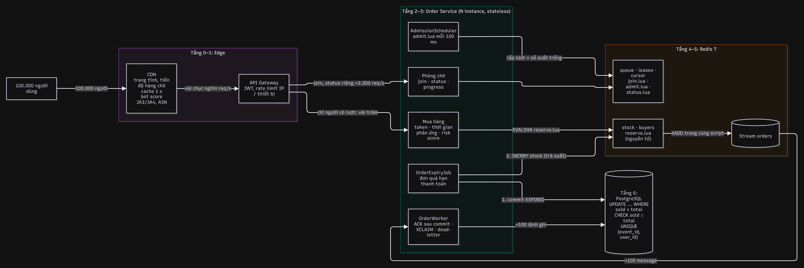
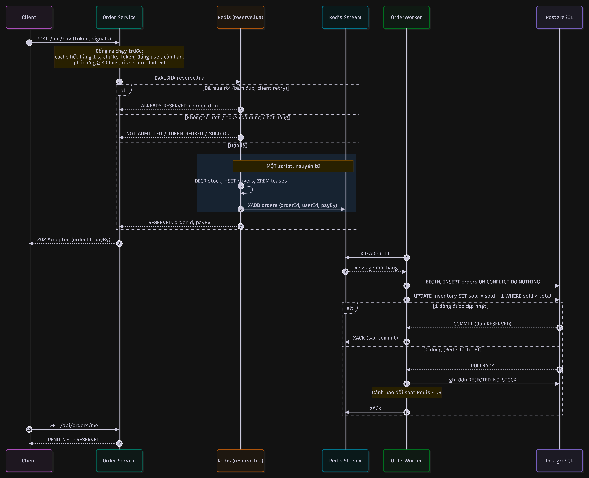
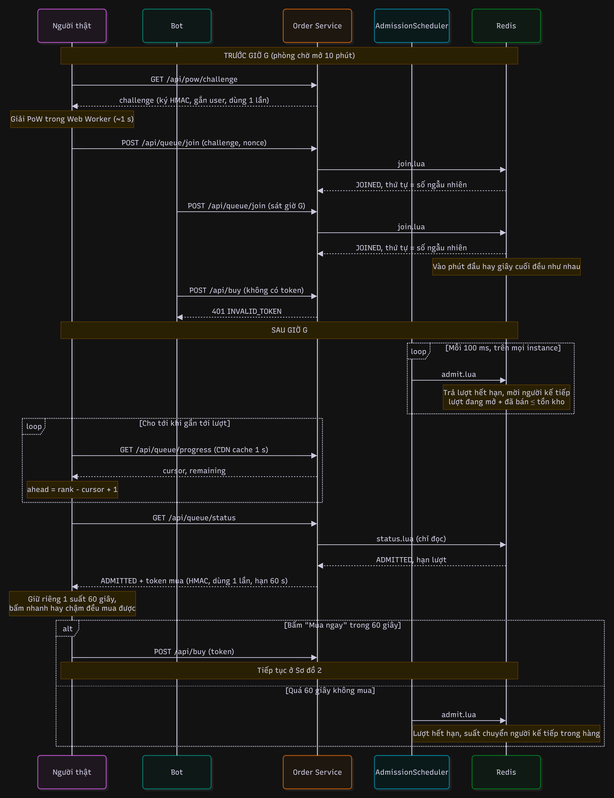

# Bài toán 2: Flash Sale 100 sản phẩm / 100.000 người

> **Tóm tắt**
> 1. **Không bán vượt:** 100.000 request không bao giờ chạm DB. Một **phễu** (CDN, phòng chờ, Redis, Stream, worker) chỉ để khoảng 100 lệnh ghi đi tới PostgreSQL. Quyết định "ai được mua" nằm trong **một script Lua nguyên tử** trên Redis. DB vẫn tự chặn bằng `UPDATE ... WHERE sold < total` + `CHECK (sold <= total)` + `UNIQUE (event_id, user_id)`. Ba lớp độc lập: một lớp sai thì lớp sau vẫn chặn.
> 2. **Công bằng giữa người và bot:** không thể phân biệt người/bot tuyệt đối, nên tôi **xóa lợi thế tốc độ** thay vì cố đoán. Ai vào phòng chờ trước giờ G được **bốc thăm thứ tự**. Đến lượt thì được **giữ riêng một suất 60 giây**. Mỗi danh tính tốn chi phí (SĐT, PoW, 1 suất/người). Bot lười bị lọc bằng tín hiệu trình duyệt và rate limit.
> 3. **Demo chạy được:** Spring Boot 3.5 + Redis 7 + PostgreSQL 16, giao diện mua hàng, dashboard vận hành, script mô phỏng bot, **15 test tích hợp** trên Redis/PostgreSQL thật (Testcontainers).

**Kết quả đo từ demo** (chi tiết ở [mục 7](#7-demo-và-kết-quả-đo)):

| Kịch bản | Kết quả |
|---|---|
| 10.000 request mua đồng thời (5.000 người × bấm 2 lần) | **Đúng 100 đơn**, 100 người khác nhau, Redis = 0, DB `sold` = 100 |
| Redis bị lệch (tưởng còn 130) | Redis cho qua 130, **DB vẫn chỉ bán 100**, 30 đơn bị từ chối và ghi nhận để đối soát |
| 200 người thật + 200 bot, **FIFO** (ai nhanh hơn thắng) | Người thật mua được **0 / 100** |
| 200 người thật + 200 bot, **phòng chờ bốc thăm** (đề xuất) | Người thật mua được **55–62 / 100** (2 lần chạy), quanh mức kỳ vọng 61% = tỉ lệ của họ trong nhóm được bốc thăm |
| Gọi thẳng API mua, không qua phòng chờ (300 request) | **300 / 300 bị chặn** (`INVALID_TOKEN`) |
| 23.911 request theo dõi hàng chờ | Redis chỉ nhận **114 lệnh** (endpoint dùng chung, có cache) |

---

## Mục lục

1. [Yêu cầu và giả định](#1-yêu-cầu-và-giả-định)
2. [Ước lượng tải](#2-ước-lượng-tải)
3. [Kiến trúc tổng thể](#3-kiến-trúc-tổng-thể)
4. [Câu hỏi 1: Không bao giờ bán vượt 100 chiếc](#4-câu-hỏi-1-không-bao-giờ-bán-vượt-100-chiếc)
5. [Câu hỏi 2: Phân biệt người thật và bot, đảm bảo công bằng](#5-câu-hỏi-2-phân-biệt-người-thật-và-bot-đảm-bảo-công-bằng)
6. [Vận hành: giám sát, cảnh báo, xử lý sự cố](#6-vận-hành-giám-sát-cảnh-báo-xử-lý-sự-cố)
7. [Demo và kết quả đo](#7-demo-và-kết-quả-đo)
8. [Trade-off và giới hạn](#8-trade-off-và-giới-hạn)

---

## 1. Yêu cầu và giả định

**Chức năng**

- Người dùng đã đăng nhập bấm "Mua ngay" để giữ một suất, sau đó thanh toán trong thời hạn.
- Mỗi người mua tối đa 1 chiếc. Đơn quá hạn thanh toán thì suất được trả cho **người kế tiếp trong hàng**.

**Phi chức năng, xếp theo thứ tự ưu tiên**

| # | Yêu cầu | Diễn giải |
|---|---|---|
| 1 | **Đúng đắn** | Tại mọi thời điểm, số suất đang bị giữ (`RESERVED` + `PAID`) ≤ 100. Không có ngoại lệ, kể cả khi Redis lỗi hay code có bug. |
| 2 | **Công bằng** | Mỗi người đủ điều kiện có cơ hội như nhau, bất kể thiết bị hay tốc độ mạng. |
| 3 | **Sống sót** | 100.000 người không được làm sập trang, sập DB, hay kéo theo các dịch vụ khác. |
| 4 | **Trải nghiệm** | Khách thấy rõ vị trí trong hàng, không phải bấm liên tục, không CAPTCHA nếu không đáng ngờ. |

Khi hai yêu cầu xung đột thì yêu cầu xếp trên thắng. Ví dụ: Redis sập thì **ngừng bán** (mất sẵn sàng) chứ không ghi thẳng DB (rủi ro đúng đắn).

**Giả định:** Java 21 / Spring Boot 3, Redis 7 (Sentinel: 1 primary + replica), PostgreSQL, cổng thanh toán có webhook, người mua đã đăng nhập bằng tài khoản xác minh SĐT. "Bán" trong bài nghĩa là **giữ suất + tạo đơn chờ thanh toán**, tiền thu sau qua cổng thanh toán.

---

## 2. Ước lượng tải

Tính trước để chọn kiến trúc, không chọn theo cảm tính.

| Giai đoạn | Lượng request | Cách tính |
|---|---|---|
| Vào phòng chờ (10 phút trước giờ G) | ~330 req/s trung bình, ~3.000 req/s ở phút cuối | 100.000 người × 2 request (lấy challenge PoW + join) / 600 s; giả định đông gấp 10 lần ở phút cuối |
| Đúng giờ G | ~20.000 req/s trong vài giây | 100.000 client hỏi trạng thái một lần; server đã rải giờ thức dậy của client trong khoảng 0–5 s (`pollAfterMs` + nhiễu ngẫu nhiên) |
| Trong lúc chờ (cách làm ngây thơ) | 100.000 req/s | Mỗi người hỏi trạng thái riêng mỗi giây |
| Trong lúc chờ (thiết kế này) | **~3.000 req/s** trạng thái riêng + endpoint tiến độ chung (CDN trả lời) | Client theo dõi `GET /queue/progress` (giống nhau cho mọi người, cache 1 s), chỉ hỏi trạng thái riêng khi tới lượt hoặc 30 s một lần: 100.000 / 30 ≈ 3.300 |
| "Mua ngay" | **Vài trăm request tổng cộng** | Chỉ người có lượt mới mua được, và số lượt đang mở ≤ số suất còn lại |
| Ghi DB | **~100 đơn + vài chục đơn hết hạn** | Worker ghi theo nhịp của DB |

**Chi phí trên Redis (đo thật, xem mục 7.3):** mỗi lần chạy script Lua tốn khoảng **30 µs CPU** của Redis. Hỏi trạng thái riêng tốn 2 script (rate limit + status), khoảng 60 µs.

- Nếu 100.000 người hỏi trạng thái riêng theo nhịp 1–5 giây: ~18.000 req/s × 60 µs ≈ **1,1 core Redis**. Vượt quá một luồng Redis duy nhất.
- Với endpoint tiến độ dùng chung: ~3.300 req/s × 60 µs ≈ **0,2 core**. Thêm vào đó, `status.lua` được khai báo chỉ đọc (`flags=no-writes`) nên chạy được trên replica nếu cần chia tải.

Đây là lý do thiết kế tách **tiến độ chung** (cache được) khỏi **trạng thái riêng** (tốn Redis), xem mục 3.2.

**Số instance app:** app không giữ trạng thái, nên scale ngang theo số request HTTP. Phải **scale trước giờ G** (pre-warm): autoscaling phản ứng sau vài phút, còn cú sốc chỉ kéo dài vài giây.

---

## 3. Kiến trúc tổng thể

### 3.1 Phễu: mỗi tầng chặn bớt cho tầng sau



| Tầng | Thành phần | Lượng request qua | Vai trò |
|---|---|---|---|
| 0 | **CDN** | 100.000 người tải trang | Trang sản phẩm, JS, ảnh tĩnh. Endpoint tiến độ hàng chờ cache 1 giây. Bot score ở edge (JA3/JA4, ASN). |
| 1 | **API Gateway** | vài chục nghìn req/s | Xác thực JWT, rate limit theo IP/subnet/thiết bị, chặn request không có token phòng chờ. |
| 2 | **Phòng chờ** (Redis ZSET) | 100.000 lượt vào, mỗi người 1 lần | Xếp hàng (bốc thăm), cấp **lượt mua** đúng bằng số suất còn trống. |
| 3 | **Order Service** (stateless, N instance) | chỉ người có lượt | Kiểm token, chống bot, gọi **Lua trừ kho**. Hết hàng thì trả lời từ cache trong bộ nhớ. |
| 4 | **Redis** (`reserve.lua`) | như trên | **Quyết định nguyên tử** ai được mua: 1 suất/người, kho > 0, ghi đơn vào Stream trong cùng bước. |
| 5 | **Redis Stream** + worker | **~100 message** | Hàng đợi bền giữa Redis và DB: consumer group, ACK, nhận lại message bỏ dở, dead-letter. |
| 6 | **PostgreSQL** | **~100 lệnh ghi** | Nguồn sự thật. `UPDATE` có điều kiện + `CHECK` + `UNIQUE`. |

**Điểm mấu chốt:** 100.000 request không bao giờ chạm DB. DB chỉ thấy khoảng 100 lệnh ghi, theo nhịp worker, nên không có tranh chấp khóa.

### 3.2 Tách đường đọc và đường ghi của phòng chờ

| | Đường ghi (cấp lượt) | Đường đọc riêng (trạng thái một người) | Đường đọc chung (tiến độ hàng) |
|---|---|---|---|
| Script / lệnh | `admit.lua` | `status.lua` (`flags=no-writes`) | `MGET cursor stock` |
| Ai gọi | Bộ hẹn giờ trong app, 10 lần/giây | Client, khi tới lượt hoặc 30 s/lần | Client, mỗi 1–3 giây |
| Tần suất trên Redis | 10 lần/s × số instance | ~3.300 lần/s | **~2 lần/s mỗi instance** (cache 500 ms), CDN chặn phần lớn |
| Chạy trên replica được? | Không (ghi) | **Có** | Có |

Cấp lượt **không** nằm trong request của người dùng, vì nếu 100.000 người hỏi trạng thái thì 100.000 lần ghi sẽ dồn vào một Redis. Nhiều instance cùng chạy bộ hẹn giờ vẫn đúng: `admit.lua` nguyên tử và giữ bất biến *"lượt đang mở + đã bán ≤ tồn kho"*, nên **không cần bầu leader**.

Client tự tính vị trí của mình bằng `ahead = rank − cursor + 1`. `rank` cố định sau giờ G (hỏi một lần), còn `cursor` dùng chung cho mọi người.

---

## 4. Câu hỏi 1: Không bao giờ bán vượt 100 chiếc

### 4.1 Vì sao cách làm "thẳng" thất bại

| Cách làm | Vấn đề |
|---|---|
| `SELECT stock` rồi `if (stock > 0) UPDATE stock = stock - 1` | **Race condition** (check-then-act): 500 request cùng đọc thấy `stock = 1`, cùng trừ, bán ra 500 chiếc. |
| `SELECT ... FOR UPDATE` (khóa bi quan) | Đúng, nhưng 100.000 request **xếp hàng trên một dòng**. Connection pool cạn, timeout dây chuyền, DB sập kéo theo cả site. |
| Optimistic lock (cột `version`) | Đúng, nhưng 99,9% request thất bại rồi retry: **retry storm** còn tệ hơn. |
| Distributed lock (Redisson) bao cả luồng | Mọi request đi tuần tự qua lock nên chậm. Lock hết hạn giữa chừng (GC pause) thì hai bên cùng giữ lock. |
| `UPDATE stock = stock - 1 WHERE stock > 0` trực tiếp | **Đúng** (nguyên tử ở mức dòng), nhưng vẫn là 100.000 lệnh ghi tranh một dòng. Dùng làm **chốt cuối**, không dùng làm cửa chính. |

**Kết luận:** vấn đề không chỉ là "đúng" mà là "đúng **và** sống sót". Cần (a) chặn phần lớn traffic trước DB, (b) quyết định "ai được mua" ở nơi nguyên tử và rất nhanh, (c) DB vẫn tự bảo vệ nếu tầng trên sai.

### 4.2 Luồng xử lý từ request đến trừ tồn kho



**Chuẩn bị (trước giờ G)**

1. Admin tạo sự kiện: `inventory(event_id, total = 100, sold = 0)` trong PostgreSQL.
2. Nạp tồn kho và cấu hình vào Redis: `SET fs:{ev}:stock 100`, `HSET fs:{ev}:meta startAt ... leaseMs ... paymentMs ...`.
3. Scale app trước (pre-warm), bật phòng chờ trước giờ G 10 phút.

**Vào hàng và chờ lượt**

4. Client lấy challenge PoW, giải trong Web Worker (~1 giây), gọi `POST /queue/join`. Script `join.lua` gán thứ tự: **bốc thăm** nếu vào trước giờ G, theo thứ tự đến nếu vào sau.
5. Sau giờ G, bộ hẹn giờ chạy `admit.lua` 10 lần/giây. Mỗi lần nó trả lại suất của những lượt đã quá hạn, rồi mời người kế tiếp cho đến khi `lượt đang mở + đã bán = tồn kho`.
6. Client theo dõi tiến độ chung `GET /queue/progress`. Khi tới lượt, `GET /queue/status` trả `ADMITTED` kèm **token mua**: ký HMAC, gắn userId, hết hạn cùng lượt, dùng một lần.

**Mua (đường nóng, không chạm DB)**

7. Người dùng bấm "Mua ngay": `POST /buy` kèm token và tín hiệu trình duyệt.
8. **Order Service**, các bước rẻ chạy trước:
   - a. Cache "hết hàng" trong bộ nhớ (hiệu lực 1 giây): hết thì trả `410` ngay, không tốn I/O.
   - b. Kiểm chữ ký token, đúng user, còn hạn (theo giờ Redis, không theo giờ client).
   - c. Thời gian phản ứng do **server** đo (từ lúc cấp token đến lúc bấm), và điểm rủi ro trình duyệt.
9. **Trừ kho nguyên tử** bằng [`reserve.lua`](demo/src/main/resources/lua/reserve.lua). Redis chạy script đơn luồng, không request nào chen vào được:

   ```lua
   if HGET buyers userId          -> ALREADY_RESERVED (trả đúng đơn cũ: bấm đúp, retry)
   if lease(userId) <= now        -> NOT_ADMITTED     (không có lượt)
   if not SET jti NX              -> TOKEN_REUSED     (token dùng một lần)
   if GET stock <= 0              -> SOLD_OUT
   payBy = now + paymentMs        -- hạn thanh toán tính từ lúc khách được báo thành công
   DECR stock
   HSET buyers userId orderId     -- 1 suất / người
   ZREM leases userId             -- lượt đã dùng: stock -1 và lease -1, số suất trống không đổi
   XADD orders * orderId userId eventId payBy   -- ghi đơn vào Stream TRONG CÙNG script
   return RESERVED, orderId, payBy
   ```

   Vì `XADD` nằm trong cùng script với `DECR`, **không có khe hở "đã trừ kho nhưng mất đơn"**. Ngược lại, nếu trừ ở Redis rồi mới gửi Kafka thì app có thể sập giữa hai bước (bài toán dual-write).
10. Trả `202 Accepted { orderId, payBy }` ngay. Client theo dõi đơn: `PENDING`, rồi `RESERVED`.

**Ghi DB (bất đồng bộ, theo nhịp của DB)**

11. [`OrderWorker`](demo/src/main/java/com/hoangha/flashsale/order/OrderWorker.java) đọc Stream qua consumer group (`XREADGROUP`), mỗi message chạy một transaction:

    ```sql
    INSERT INTO orders (id, event_id, user_id, status, expires_at) VALUES (?, ?, ?, 'RESERVED', ?)
    ON CONFLICT DO NOTHING;                     -- xử lý lại cùng message: không tạo đơn thứ hai
    UPDATE inventory SET sold = sold + 1
    WHERE event_id = ? AND sold < total;        -- 0 dòng => DB đã đủ 100 => ROLLBACK
    COMMIT;  XACK                               -- ACK SAU khi commit
    ```

    Nếu `UPDATE` trả 0 dòng (Redis cho qua nhưng DB đã đủ 100), đơn bị đánh dấu `REJECTED_NO_STOCK`, khách được báo, và hệ thống cảnh báo để đối soát.

### 4.3 Vì sao chắc chắn không vượt 100: ba lớp độc lập

| Lớp | Cơ chế | Vẫn đúng khi... | Test |
|---|---|---|---|
| Redis | `reserve.lua` nguyên tử: kiểm + trừ trong một bước | Hàng trăm instance, hàng chục nghìn request cùng lúc | `neverOversellsWith10000ConcurrentBuyRequests` |
| DB: câu lệnh | `UPDATE ... WHERE sold < total` nguyên tử ở mức dòng | Redis bị lệch (failover mất dữ liệu, nạp sai tồn kho) | `databaseStillCapsAt100WhenRedisStockIsWrong` |
| DB: ràng buộc | `CHECK (sold <= total)`, `UNIQUE (event_id, user_id)`, PK `orderId` | Code worker có bug; message bị xử lý lại | (ràng buộc schema, [schema.sql](demo/src/main/resources/schema.sql)) |

### 4.4 Vòng đời đơn hàng

| Trạng thái | Ở đâu | Chuyển sang | Khi nào |
|---|---|---|---|
| `PENDING` | chỉ trong Redis (`buyers`) + Stream | `RESERVED` | worker ghi DB xong (vài chục ms) |
| `RESERVED` | DB, giữ 1 suất | `PAID` | webhook thanh toán thành công trước `expires_at` |
| `RESERVED` | DB | `EXPIRED` | quá `expires_at`: job trả suất về hàng chờ |
| `REJECTED_NO_STOCK` | DB, không giữ suất | (cuối) | Redis lệch, DB từ chối |

**Thanh toán và hết hạn không thể cùng thắng.** Cả hai đều là `UPDATE ... WHERE status = 'RESERVED'` trên cùng một dòng. Khóa dòng của PostgreSQL xếp chúng nối tiếp, và lệnh đến sau thấy điều kiện không còn đúng. Gọi thanh toán lặp lại (webhook gửi lặp) trả `ALREADY_PAID`.

**Trả suất khi đơn hết hạn** ([`OrderExpiryJob`](demo/src/main/java/com/hoangha/flashsale/order/OrderExpiryJob.java)):

```sql
WITH due AS (SELECT id FROM orders WHERE status = 'RESERVED' AND expires_at <= now()
             ORDER BY expires_at LIMIT 100 FOR UPDATE SKIP LOCKED)   -- nhiều instance chạy song song an toàn
UPDATE orders SET status = 'EXPIRED' FROM due WHERE orders.id = due.id RETURNING id;
UPDATE inventory SET sold = sold - :n;   COMMIT;
INCRBY fs:{ev}:stock :n                  -- SAU commit
```

- **Commit DB trước, cộng Redis sau.** Sập giữa hai bước thì Redis *thiếu* suất (bán ít hơn), không bao giờ *thừa* (bán vượt). Đây là chọn hướng lỗi an toàn.
- Suất trả về **không mở cho ai nhanh nhất**: tồn kho Redis tăng, rồi `admit.lua` mời người kế tiếp trong hàng.
- Người để đơn hết hạn **không** được mua lại (vẫn nằm trong `buyers`), để không thành kẽ hở giữ suất ảo.

### 4.5 Tình huống lỗi

| Tình huống | Điều xảy ra | Xử lý | Có test |
|---|---|---|---|
| Khách bấm đúp / client retry | Hai request cùng user | `buyers` HASH: lần sau trả **đúng orderId cũ**, không trừ thêm | có |
| App sập sau khi Lua thành công, trước khi trả lời | Khách không nhận phản hồi | Khách gửi lại thì nhận lại đơn cũ. Đơn đã nằm trong Stream nên không mất | có |
| Worker sập trước khi ACK | Message nằm trong pending list (PEL) | Khởi động lại với **cùng tên consumer** thì đọc lại PEL của mình. Ghi DB idempotent theo `orderId` | |
| Instance worker chết hẳn | PEL của nó không ai đọc | Worker còn sống quét `XPENDING`, message idle > 30 s thì `XCLAIM` về xử lý | có |
| Message hỏng (poison) | Xử lý lỗi lặp lại | Quá 5 lần giao thì chuyển **dead-letter stream** + ACK, để không chặn đơn của người khác | có |
| DB chậm/sập vài phút | Đơn dồn lại | Stream đóng vai bộ đệm, khách thấy `PENDING`. DB hồi phục thì worker ghi tiếp. Không mất đơn, không bán thêm | |
| Redis failover mất vài lệnh `DECR` | Redis tưởng còn nhiều hơn thực tế | DB chặn (lớp 2), đơn thừa bị `REJECTED_NO_STOCK`. Sau failover **nạp lại tồn kho Redis từ DB** (mục 6.3) | có |
| Redis mất hẳn | Không quyết định được ai mua | **Ngừng bán** (`503 + Retry-After`) thay vì ghi thẳng DB | |
| Webhook thanh toán gửi lặp | Hai lần "đã trả tiền" | `UPDATE ... WHERE status = 'RESERVED'` chỉ đổi một lần; lần sau `ALREADY_PAID` | có |
| Đơn hết hạn đúng lúc khách thanh toán | Hai lệnh tranh một dòng | Khóa dòng xếp nối tiếp; lệnh sau thấy status đã đổi | có |
| Lệch đồng hồ giữa các máy app | Mở bán sớm/muộn khác nhau | Mọi mốc giờ trong Lua lấy từ `TIME` của Redis | |

---

## 5. Câu hỏi 2: Phân biệt người thật và bot, đảm bảo công bằng

### 5.1 Nhìn nhận thẳng thắn

- **Không có cách nào phân biệt người/bot 100%.** Bot dùng trình duyệt thật (Puppeteer + stealth), giả fingerprint, thuê người giải CAPTCHA. Demo chứng minh điều này: "bot tinh vi" gửi tín hiệu trình duyệt giống hệt người thật.
- **Cuộc đua mili-giây là luật chơi bot chắc thắng.** Với FIFO, bot thắng 100/100 trong mô phỏng: chúng canh đúng giờ G và phản ứng trong vài ms.
- Vì vậy chiến lược có 4 phần: **(A) xóa lợi thế tốc độ, (B) làm mỗi danh tính tốn tiền, (C) lọc bot lười, (D) hậu kiểm.** Công bằng được định nghĩa là: *mỗi người đủ điều kiện có cơ hội như nhau, bất kể thiết bị hay tốc độ mạng.*



### 5.2 (A) Phòng chờ bốc thăm

- Phòng chờ mở **trước** giờ G (10 phút). Ai vào trong khoảng này nhận một **số ngẫu nhiên** do server sinh (`SecureRandom`) làm thứ tự. Vào phút thứ 1 hay giây cuối đều như nhau.
- Ai đến **sau** giờ G xếp sau toàn bộ nhóm trước, theo thứ tự đến.
- Không cho vào lại để "quay số" lần nữa (`ALREADY_IN_QUEUE`). Vị trí không lộ trước giờ G.
- **Hệ quả:** script bắn request trong mili-giây đầu tiên **mất hoàn toàn tác dụng**. Queue-it và Cloudflare Waiting Room (chế độ pre-queue) cũng làm theo cách này.

### 5.3 (A) Giữ suất theo lượt: chặn lợi thế tốc độ ở bước sau

Bài học rút ra từ chính demo: phiên bản đầu cho phòng chờ mở cửa **200 người/giây** (nhiều hơn số hàng), rồi ai bấm nhanh hơn thì mua được. Kết quả: dù thứ tự đã xáo, **người thật chỉ được 13/100**, vì bot vào sau vẫn bấm trước người vào trước.

Cách sửa ([`admit.lua`](demo/src/main/resources/lua/admit.lua)):

- Chỉ mời đúng **số người bằng số suất còn trống**: `lượt đang mở + đã bán ≤ tồn kho`.
- Người được mời **được giữ riêng một suất trong 60 giây**, nên bấm sau 0,3 giây hay 30 giây đều mua được.
- Quá 60 giây không mua thì lượt hết hạn, suất chuyển cho **người kế tiếp trong hàng**.
- Kết quả sau khi sửa: **người thật 55–62/100**, quanh tỉ lệ của họ trong nhóm được bốc thăm (mục 7.1).

### 5.4 (B) Làm mỗi danh tính tốn chi phí

| Cơ chế | Cách làm | Trade-off |
|---|---|---|
| **Tài khoản đủ điều kiện** | Xác minh SĐT bằng OTP (1 SĐT = 1 tài khoản, chặn đầu số ảo), tài khoản tạo trước sự kiện ≥ 7 ngày, hoặc **đăng ký tham gia** trước 24 giờ | Ma sát cho người mới. Đổi lại có thời gian phân tích cụm tài khoản **trước** sự kiện |
| **1 suất / danh tính** | Giới hạn theo user (đã cài). Khi thanh toán/giao hàng thêm giới hạn theo **SĐT, thẻ, địa chỉ giao, thiết bị** | Gia đình dùng chung địa chỉ có thể bị ảnh hưởng: có kênh khiếu nại |
| **Proof-of-Work** | Vào phòng chờ phải giải SHA-256 (~1 giây CPU, chạy trong Web Worker). Challenge ký HMAC, gắn user, dùng một lần | Người thật trả 1 giây một lần, kẻ chạy 10.000 tài khoản trả 10.000 lần. Máy yếu chậm hơn: độ khó chỉnh theo rủi ro |
| **Token phòng chờ** | Không có token (chỉ cấp khi đến lượt) thì không mua được. Token gắn user, có hạn, dùng một lần | Gọi thẳng API mua bị chặn hết (demo: 300/300) |

### 5.5 (C) Lọc bot "lười" và chống dội request

| Tín hiệu | Ở đâu | Ghi chú |
|---|---|---|
| Bot score: TLS fingerprint JA3/JA4, ASN datacenter, header bất thường | CDN/WAF (Cloudflare Bot Management, AWS WAF Bot Control) | Chặn script `curl`/`requests`, VPS |
| CAPTCHA vô hình (Turnstile / reCAPTCHA v3) | Lúc vào phòng chờ | Chỉ hiện thử thách khi điểm rủi ro cao |
| `navigator.webdriver`, click `isTrusted`, chuyển động chuột/chạm, màn hình | Trình duyệt, gửi kèm request mua | **Giả được**: chỉ bắt Selenium/Puppeteer mặc định. Điểm cao thì đòi CAPTCHA, không chặn cứng |
| **Thời gian phản ứng do server đo** | Server | Không giả được con số, nhưng bot có thể chờ. Tác dụng chính là xóa lợi thế tốc độ |
| **Rate limit theo user** (đã cài: 5 req/s mỗi nhóm endpoint, trả `429 + Retry-After`) | App, bộ đếm trong Redis | Bot dội trạng thái mỗi 50 ms bị chặn (demo: hàng chục nghìn request `429` mỗi vòng). Redis lỗi thì cho qua (fail-open) vì các cổng phía sau vẫn đảm bảo đúng đắn |
| Rate limit theo IP/subnet/thiết bị | Gateway/CDN | Chiều không phụ thuộc tài khoản |

### 5.6 (D) Hậu kiểm trước khi giao hàng

- Gom cụm đơn theo thiết bị, thẻ, địa chỉ, dải SĐT, thời điểm tạo tài khoản. Cụm đáng ngờ thì **hủy đơn, hoàn tiền**, và trả suất cho người kế tiếp trong hàng (cùng cơ chế với đơn hết hạn).
- Điều khoản chương trình nêu rõ quyền hủy đơn mua bằng công cụ tự động.
- Lý do: lúc bán phải quyết định trong mili-giây, còn hậu kiểm có hàng giờ với dữ liệu đầy đủ.

### 5.7 Ma trận: kẻ gian nào bị chặn ở đâu

| Loại kẻ gian | Chặn bởi |
|---|---|
| Script gọi thẳng API lúc 0 ms | Token phòng chờ (không có token thì không mua được) |
| Script nhanh, canh giờ G | Bốc thăm + giữ suất theo lượt (nhanh không còn lợi thế) |
| Script dội request liên tục | Rate limit theo user (app) và theo IP/thiết bị (gateway) |
| Selenium/Puppeteer mặc định | Tín hiệu trình duyệt, bot score, CAPTCHA |
| Bot tinh vi, 1 tài khoản | Không chặn được và **không cần chặn**: nó chỉ có cơ hội như một người |
| Bot tinh vi, 1.000 tài khoản | Chi phí SĐT + PoW + tuổi tài khoản; giới hạn theo thẻ/địa chỉ; hậu kiểm cụm |
| Thuê người thật bấm hộ | Không phân biệt được bằng kỹ thuật; giới hạn theo thẻ/địa chỉ + hậu kiểm |

---

## 6. Vận hành: giám sát, cảnh báo, xử lý sự cố

### 6.1 Chỉ số (đã cài, xuất ra `/actuator/prometheus`)

| Metric | Ý nghĩa | Cảnh báo khi |
|---|---|---|
| `flashsale_purchase_total{outcome}` | Kết quả mỗi request mua | `CHALLENGE_REQUIRED` hoặc `INVALID_TOKEN` tăng vọt: đang bị bot tấn công |
| `flashsale_orders_persisted_total{result="REJECTED_NO_STOCK"}` | Redis cho qua nhưng DB từ chối | **> 0: Redis lệch DB**, chạy đối soát |
| `flashsale_orders_dead_lettered_total` | Message không xử lý được | > 0: có đơn cần người kiểm tra |
| `flashsale_reserve_latency_seconds` (p50, p99) | Thời gian chạy `reserve.lua` | p99 tăng: Redis quá tải |
| `flashsale_rate_limited_total{group}` | Request bị 429 | Tăng vọt: có client dội request |
| `flashsale_queue_admitted_total`, `flashsale_orders_expired_total` | Nhịp cấp lượt, suất được trả lại | Cấp lượt dừng trong lúc còn hàng: bộ hẹn giờ có vấn đề |
| Health `/actuator/health` | Redis, DB | Bất kỳ thành phần `DOWN` |

**Dashboard vận hành** (`/admin.html`) hiển thị trực tiếp các bất biến: `sold ≤ total`, `RESERVED + PAID = sold`, `lượt đang mở ≤ tồn kho Redis`, không có đơn bị từ chối, không có dead-letter. Ngoài ra có tỉ lệ người giữ suất theo nhóm và phân bố kết quả request mua.

### 6.2 Checklist trước giờ G

1. Pre-warm: scale app lên số instance dự tính, làm nóng connection pool và JIT.
2. Nạp tồn kho Redis từ DB, kiểm tra `meta` (giờ mở bán, thời hạn lượt, thời hạn thanh toán).
3. Bật cache CDN cho `/api/queue/progress` (1 giây) và trang tĩnh.
4. Kiểm tra Sentinel failover và health check.
5. Mở dashboard, đặt cảnh báo cho các metric ở bảng trên.

### 6.3 Runbook: Redis failover giữa đợt bán

1. App tự trả `503 + Retry-After` trong lúc Redis không phản hồi. Không bán thêm, không ghi thẳng DB.
2. Sau khi primary mới lên: **tạm dừng cấp lượt** và tính lại tồn kho từ DB:
   `stock = total − (đơn RESERVED + PAID trong DB) − (đơn trong Stream chưa ghi DB)`.
   Đồng thời dựng lại `buyers` từ bảng `orders`.
3. Mở lại cấp lượt. Đơn mà Redis đã báo khách thành công nhưng bị mất khi failover (nếu có) phải báo lại cho khách. Rủi ro này giảm được bằng `WAIT 1` sau `reserve.lua` (chờ replica xác nhận), đổi lại tăng độ trễ.

*Bước 2 hiện mới là thiết kế, demo chưa cài (xem mục 8).*

---

## 7. Demo và kết quả đo

Hướng dẫn chạy, API và cấu trúc code: [demo/README.md](demo/README.md).

### 7.1 Mô phỏng người thật và bot

`node tools/simulate.mjs`: 200 người thật + 100 bot tinh vi + 100 bot lười, 100 sản phẩm. Một lần chạy trên máy (có dao động do ngẫu nhiên):

| Chế độ | Người thật | Bot tinh vi | Bot lười | Đơn bỏ ngang chuyển người sau | Request bị 429 | DB đã bán | Bán vượt? |
|---|---|---|---|---|---|---|---|
| FIFO (ai nhanh hơn thắng) | **0** | 100 | 0 | 0 | 19.737 | 100 | không |
| Bốc thăm + giữ suất theo lượt | **55** | 45 | 0 | 6 | 58.638 | 100 | không |

Một lần chạy khác của chế độ bốc thăm: người thật 62, bot tinh vi 38. Dao động là bình thường vì thứ tự được bốc thăm.

**Cách đọc con số 55–62.** Mô phỏng cho 20% người thật đến *sau* giờ G (rải từ G−12 s đến G+3 s), nên họ xếp sau toàn bộ nhóm vào trước. Nhóm được bốc thăm vì thế gồm khoảng 160 người thật + 100 bot tinh vi (bot lười cũng được mời nhưng bị đòi CAPTCHA, nên lượt của chúng hết hạn và chuyển người sau). Kỳ vọng: 160 / 260 ≈ **61%** cho người thật. Nghĩa là **mỗi tài khoản có cơ hội như nhau**, tốc độ không còn quyết định.

- Đếm theo **đơn đã thanh toán**. 10% người thật bỏ ngang không thanh toán, nên đơn hết hạn và suất chuyển cho người kế tiếp trong hàng.
- Bot tinh vi là scalper: giả tín hiệu trình duyệt hoàn hảo, giải PoW, canh đúng giờ G, luôn thanh toán. Mỗi bot có cơ hội đúng bằng một người thường, không hơn. Muốn nhiều suất hơn thì phải có nhiều tài khoản thật, và đó là việc của mục 5.4 và 5.6.
- Gọi thẳng API mua, không qua phòng chờ: `{ INVALID_TOKEN: 300 }`.

### 7.2 Test tích hợp (15 test, Redis + PostgreSQL thật qua Testcontainers)

| Nhóm | Test |
|---|---|
| Không bán vượt | 10.000 request đồng thời ra đúng 100 đơn; Redis lệch thì DB vẫn chặn ở 100 |
| Cổng chống bot | Không token / token giả / token người khác / quá nhanh / headless / hết hạn / không có lượt; token dùng một lần; PoW sai, của người khác, dùng lại |
| Công bằng | Bốc thăm làm tốc độ vô nghĩa; FIFO thưởng người nhanh nhất (đối chứng); người đến sau giờ G xếp sau |
| Phòng chờ | Lượt đang mở không vượt tồn kho, lượt quá hạn chuyển người kế tiếp; hỏi trạng thái không cấp lượt; tiến độ chung cache được và khớp vị trí riêng |
| Worker | Nhận lại đơn của instance đã chết (`XCLAIM`); message hỏng chuyển dead-letter, không chặn hàng đợi |
| Vòng đời đơn | Đơn không thanh toán hết hạn, suất về đúng người kế tiếp; webhook gửi lặp idempotent; thanh toán sau hạn bị từ chối |
| Rate limit | Dội request bị `429 + Retry-After`, người khác không bị ảnh hưởng |

### 7.3 Số đo hiệu năng và cách đọc

| Đo | Kết quả | Ghi chú |
|---|---|---|
| CPU Redis cho mỗi lần chạy script Lua | **~30 µs** | `INFO commandstats` trong container |
| Độ trễ Redis đo trong container | 0,28 ms trung bình | `redis-cli --latency` |
| `reserve.lua` đo từ app | p50 2,2 ms | Phần lớn là lớp mạng Docker Desktop trên Windows, không phải Redis |
| Theo dõi tiến độ chung: 23.911 request | **114 lệnh `MGET`** trên Redis | Cache 500 ms trong app; CDN còn chặn thêm |
| Một instance, đường đọc trạng thái riêng | ~2.400 req/s | **Cận dưới**, bị giới hạn bởi công cụ tạo tải (Node 1 luồng) và mạng Docker Desktop; app chỉ dùng ~2/12 core. Không phải số liệu production |

Cách đọc đúng: con số tuyệt đối trên laptop không quan trọng bằng **tỉ lệ**. Đường mua tốn Redis O(1) và chỉ người có lượt mới đi vào. Đường chờ không tăng tải Redis theo số người. DB chỉ thấy khoảng 100 lệnh ghi.

---

## 8. Trade-off và giới hạn

### 8.1 Trade-off chính

| Quyết định | Được | Mất |
|---|---|---|
| Bốc thăm thay vì FIFO | Bot hết lợi thế tốc độ | "Ai đến trước được trước" không còn: phải truyền thông rõ luật cho khách |
| Giữ suất 60 giây cho người có lượt | Khách chậm vẫn mua được | Suất của người bỏ lượt quay lại chậm hơn 60 giây |
| Redis là cổng quyết định | Nhanh, không khóa DB | Thêm thành phần; cần đối soát với DB khi failover |
| Ghi đơn bất đồng bộ (202 + Stream) | DB không bị dồn, chịu được DB chậm | Khách thấy `PENDING` vài chục ms; logic đối soát phức tạp hơn |
| Tách tiến độ chung khỏi trạng thái riêng | Tải Redis không tăng theo số người chờ | Client phức tạp hơn; vị trí hiển thị trễ tối đa ~1 giây |
| Bắt buộc đăng nhập + SĐT + PoW | Mỗi tài khoản giả tốn tiền và CPU | Ma sát; máy yếu chậm hơn vài giây |
| Ngừng bán khi Redis lỗi | Không bao giờ bán vượt | Mất sẵn sàng trong lúc failover (vài chục giây) |
| Rate limit fail-open | Redis lỗi không làm sập cả trang | Mất lớp rate limit trong lúc Redis lỗi (các cổng sau vẫn đúng) |

### 8.2 Phạm vi demo (đơn giản hóa có chủ đích)

- Danh tính lấy từ header `X-User-Id` thay vì JWT đã xác thực.
- Thanh toán là endpoint giả lập webhook (chưa có chữ ký HMAC của cổng thanh toán, chưa có hoàn tiền).
- Chưa có CAPTCHA thật, bot score ở edge, rate limit theo IP ở gateway.
- Đối soát Redis–DB sau failover (mục 6.3) mới là thiết kế, chưa có endpoint.
- Chạy một Redis đơn, không có replica/Sentinel; `status.lua` đã sẵn sàng chạy trên replica nhưng demo chưa định tuyến đọc sang replica.
